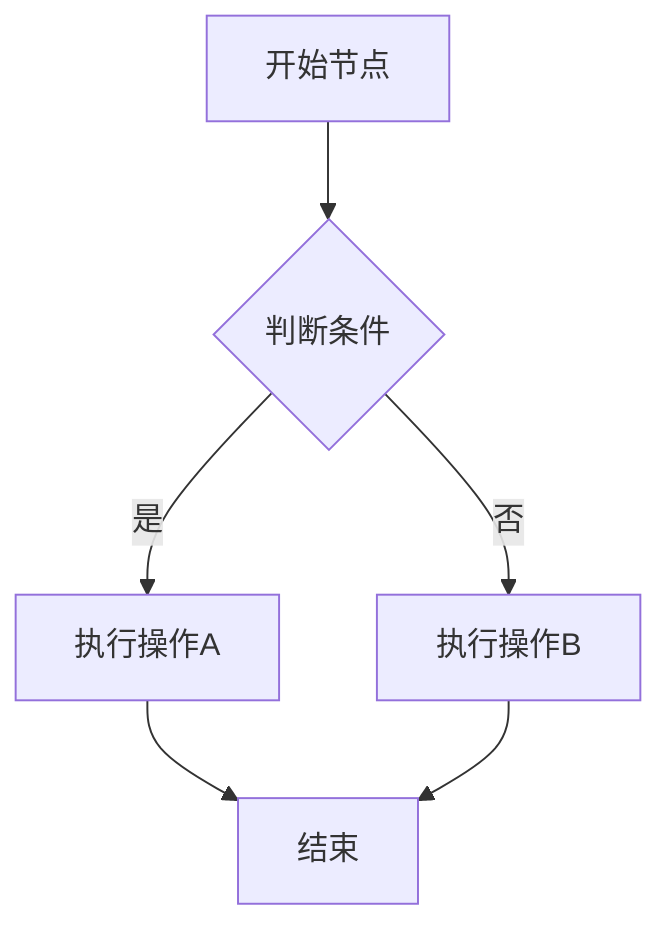
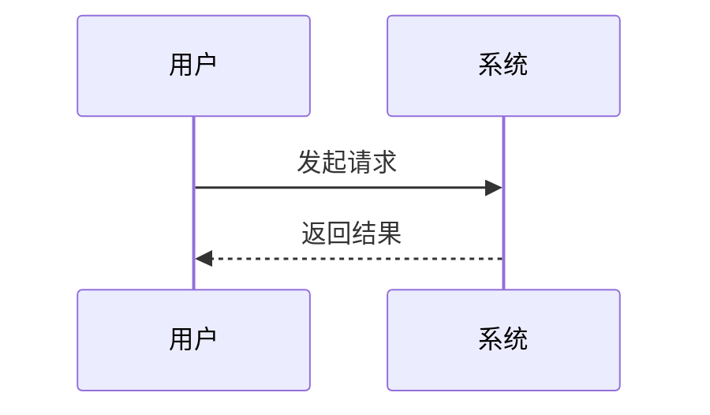
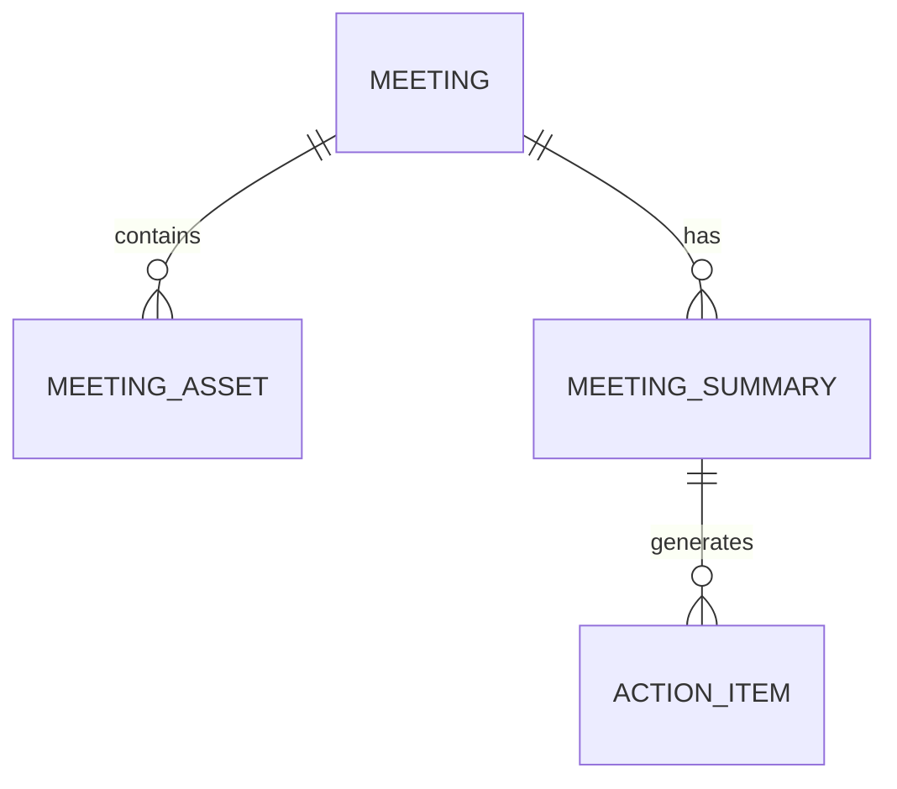
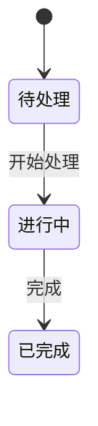

---
name: flowchart-generator
description: 根据需求文档生成业务流程图（Mermaid格式）和业务关联图（HTML可视化）。支持flowchart、sequence、ER图等多种图表类型。当用户提到"流程图"、"时序图"、"ER图"、"关联图"、"mermaid"、"业务流程"时激活。
---

# 流程图生成 Skill

根据需求文档生成 Mermaid 格式的业务流程图和 HTML 可视化关联图。

## 触发场景

- 用户要求画流程图、时序图、ER图
- 用户说"帮我画个业务流程"
- 用户提供需求文档要求生成可视化图表

## 执行流程

### Phase 1: 分析需求

1. 读取项目中的需求文档
2. 识别业务流程、数据关系、交互时序
3. 确认需要生成哪些类型的图表

### Phase 2: 语法校验（必做）

在生成 Mermaid 代码前，确认使用正确的语法：
- flowchart 使用 `flowchart TD` 或 `flowchart LR`
- 节点用 `[]` 方括号（矩形）、`{}` 菱形（判断）、`()` 圆角
- 连线用 `-->` 实线箭头、`-.->` 虚线箭头、`==>` 粗线箭头
- 条件分支用 `-->|条件文字|`
- 子图用 `subgraph 标题 ... end`

参考：https://mermaid.js.org/syntax/flowchart.html

### Phase 3: 生成业务流程图（.mmd 文件）

**规则：.mmd 文件仅包含 Mermaid 语句，不加任何额外字符、注释或说明文字。**



**命名规则：** `[业务流程图]{功能名}.mmd`

**内容要求：**
- 节点文字使用中文
- 覆盖主流程 + 异常分支
- 包含关键判断节点
- 流程方向默认 TD（从上到下），复杂流程可用 LR（从左到右）

### Phase 4: 生成业务关联图（HTML 文件）

生成可在浏览器直接打开的交互式关联图：

**模板结构：**
```html
<!DOCTYPE html>
<html lang="zh-CN">
<head>
    <meta charset="UTF-8">
    <title>[业务关联图]{功能名}</title>
    <style>
        body { font-family: 'PingFang SC', 'Microsoft YaHei', sans-serif; background: #f0f2f5; padding: 40px; }
        .container { max-width: 1200px; margin: 0 auto; }
        .title { text-align: center; font-size: 24px; margin-bottom: 30px; color: #333; }
        /* 节点样式 */
        .node { position: absolute; padding: 12px 20px; border-radius: 8px; background: white; box-shadow: 0 2px 8px rgba(0,0,0,0.1); cursor: pointer; transition: transform 0.2s; }
        .node:hover { transform: scale(1.05); box-shadow: 0 4px 12px rgba(0,0,0,0.15); }
        .node-core { background: #1890ff; color: white; }
        .node-support { background: #52c41a; color: white; }
        .node-external { background: #faad14; color: white; }
        /* 连线用 SVG */
        svg { position: absolute; top: 0; left: 0; width: 100%; height: 100%; pointer-events: none; }
    </style>
</head>
<body>
    <div class="container">
        <h1 class="title">{功能名} 业务关联图</h1>
        <div class="graph" style="position: relative; height: 600px;">
            <!-- 节点和连线 -->
        </div>
        <div class="legend">
            <span class="legend-item"><span class="dot core"></span>核心模块</span>
            <span class="legend-item"><span class="dot support"></span>支撑模块</span>
            <span class="legend-item"><span class="dot external"></span>外部依赖</span>
        </div>
    </div>
</body>
</html>
```

**命名规则：** `[业务关联图]{功能名}.html`

**内容要求：**
- 展示模块间的数据流向和依赖关系
- 核心模块居中，支撑模块环绕
- 用不同颜色区分模块类型（核心/支撑/外部）
- 连线标注关系类型（数据流/调用/依赖）
- 有图例说明

## 支持的图表类型

### 1. 业务流程图（flowchart）— 最常用
展示业务操作的先后顺序和分支判断。

### 2. 时序图（sequence）
展示多个角色/系统间的交互时序。


### 3. ER图（erDiagram）
展示数据实体间的关系。


### 4. 状态图（stateDiagram）
展示对象的状态流转。


## 输出规则

- `.mmd` 文件：仅含 Mermaid 语句，无任何额外内容
- `.html` 文件：完全独立，可直接在浏览器打开
- 节点文字使用中文
- 文件保存到 `docs/diagrams/` 目录
- 文件编码 UTF-8
- 每个图表附带简短的文字说明（在生成时告知用户，不写入 .mmd 文件）
