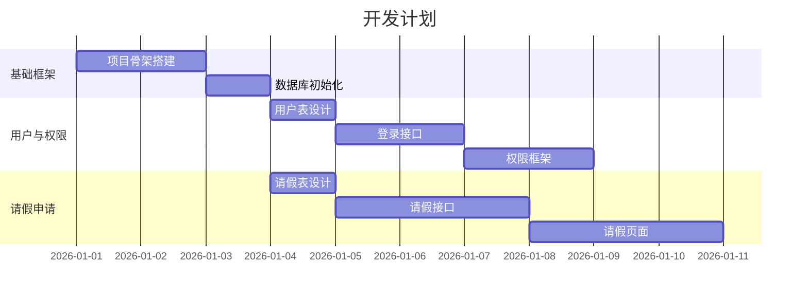

# 任务拆解 Skill

将大需求系统化拆解为子需求和开发任务，形成可执行的开发计划。

## 触发场景

- 售前需求确认后，需要拆解为可执行任务
- 用户说"帮我拆解任务"、"做个开发计划"
- 需要评估工作量和排期

## 拆解层级（WBS 工作分解结构）

```
项目（整体需求）
├── 子需求1（功能模块）
│   ├── 任务1.1（具体开发任务）
│   ├── 任务1.2
│   └── 任务1.3
├── 子需求2（功能模块）
│   ├── 任务2.1
│   └── 任务2.2
└── 子需求3（功能模块）
    └── ...
```

## 执行流程

### Phase 1: 识别子需求

从售前需求文档中提取功能模块，每个模块作为一个子需求：

**拆解原则：**
- 每个子需求是一个独立可交付的功能单元
- 子需求之间的依赖关系要明确
- 子需求粒度适中（1-2周可完成）

**输出格式：**
```markdown
## 子需求清单

| 编号 | 子需求名称 | 描述 | 优先级 | 依赖 |
|---|---|---|---|---|
| SR-001 | 基础框架搭建 | 项目骨架、公共组件、数据库初始化 | P0 | 无 |
| SR-002 | 用户与权限 | 登录、角色、权限配置 | P0 | SR-001 |
| SR-003 | 请假申请 | 申请表单、草稿、提交 | P1 | SR-002 |
| SR-004 | 审批流程 | 多级审批、驳回、撤回 | P1 | SR-003 |
| SR-005 | 假期余额 | 余额初始化、扣减、查询 | P1 | SR-002 |
| SR-006 | 统计报表 | 请假统计、导出 | P2 | SR-003,SR-005 |
```

### Phase 2: 拆解开发任务

每个子需求拆解为具体的开发任务：

**任务类型：**
- `[DB]` 数据库变更（建表、加字段、加索引）
- `[BE]` 后端开发（接口、服务、数据访问）
- `[FE]` 前端开发（页面、组件、交互）
- `[TEST]` 测试（单元测试、集成测试）
- `[DOC]` 文档（接口文档、部署文档）

**输出格式：**
```markdown
## SR-003: 请假申请 — 任务清单

| 任务编号 | 类型 | 任务名称 | 描述 | 工时(h) | 依赖 | 状态 |
|---|---|---|---|---|---|---|
| TASK-003-01 | [DB] | 请假申请表设计 | leave_request 表DDL | 1 | - | 待开发 |
| TASK-003-02 | [BE] | 请假申请接口 | 创建/编辑/提交/撤回 | 4 | 003-01 | 待开发 |
| TASK-003-03 | [BE] | 余额校验服务 | 提交时校验假期余额 | 2 | 003-02 | 待开发 |
| TASK-003-04 | [FE] | 请假申请页面 | 表单+日期选择+附件 | 4 | 003-02 | 待开发 |
| TASK-003-05 | [FE] | 请假记录列表 | 列表+筛选+状态标签 | 3 | 003-02 | 待开发 |
| TASK-003-06 | [TEST] | 请假申请测试 | 单元+集成测试 | 2 | 003-02,003-03 | 待开发 |
```

### Phase 3: 确定依赖关系和执行顺序

生成任务依赖图（Mermaid）：



### Phase 4: 里程碑划分

```markdown
## 里程碑计划

| 里程碑 | 包含子需求 | 交付物 | 预计完成 |
|---|---|---|---|
| M1: 基础可运行 | SR-001, SR-002 | 项目可启动、可登录 | 第1周 |
| M2: 核心流程跑通 | SR-003, SR-004 | 请假+审批完整流程 | 第2-3周 |
| M3: 功能完善 | SR-005, SR-006 | 余额管理+统计报表 | 第4周 |
| M4: 测试与交付 | 全部测试通过 | 可上线版本 | 第5周 |
```

### Phase 5: 输出任务文档

**产出文件**: `docs/tasks/开发任务清单.md`

文档结构：
```markdown
# {项目名} 开发任务清单

## 一、子需求清单
（Phase 1 的表格）

## 二、任务明细
### SR-001: {子需求名}
（Phase 2 的任务表格）
### SR-002: {子需求名}
...

## 三、依赖关系图
（Phase 3 的 Mermaid 甘特图）

## 四、里程碑计划
（Phase 4 的表格）

## 五、开发顺序建议
按依赖关系排列的推荐开发顺序：
1. TASK-001-01 → TASK-001-02 → ...
2. ...
```

## 拆解原则

1. **单一职责**：每个任务只做一件事
2. **可验证**：每个任务完成后有明确的验收标准
3. **粒度适中**：单个任务 1-8 小时，超过 8 小时需要继续拆分
4. **依赖清晰**：明确标注前置任务，避免循环依赖
5. **优先级明确**：P0 必须做、P1 应该做、P2 可以延后

## 与工作流的关系

```
Phase 1: 需求分析 → 产出售前需求文档
    ↓
Phase 1.5: 任务拆解 ← 本 skill（在需求确认后、原型设计前执行）
    ↓
Phase 2: 原型设计（按子需求逐个设计）
    ↓
...后续按任务清单逐个执行
```

## 输出规则

- 任务编号格式：`TASK-{子需求编号}-{序号}`
- 子需求编号格式：`SR-{三位数字}`
- 工时单位：小时（h）
- 所有输出使用中文
- 保存到 `docs/tasks/` 目录


## V1.1 两段式计划覆盖

前文的详细任务拆解改为两步：

### A. 里程碑路线图

在 PRD 确认后生成 `docs/tasks/ROADMAP.md`，只记录模块、优先级、里程碑、交付物、依赖和风险，不必过早拆到文件级任务。

### B. 可执行 TODO

在 PRD、DESIGN（如适用）和 ARCHITECTURE 确认后，生成 `docs/TODO.md` 与详细任务清单。每个任务除原字段外，必须增加：

- 修改目标。
- 允许修改范围。
- 不可破坏的业务、兼容性、数据或安全逻辑。
- 可观察的验收标准。
- 单元、集成、E2E 或手工测试要求。

每次只取一个 TODO 执行。需求或架构变化时，先更新对应事实源，再重排受影响任务。


## V1.2 版本任务与维护任务

版本迭代的 TODO 必须关联版本号，并增加“受影响已有能力”和“回归范围”字段。发布完成后关闭或归档该版本 TODO，并将未完成项回写 ROADMAP。

维护任务必须关联维护记录，明确最小修复范围、禁止混入的改动、复现步骤、定向测试和回归测试。紧急修复仍必须更新状态和发布记录。

## V1.3.1 TODO 风险标记

每个可执行 TODO 应轻量标记风险类型：资金、权限、数据或普通，并说明是否需要纳入发布前风险测试。不要在任务拆解阶段编写大量测试脚本。

建议字段：

| 任务 | 风险类型 | 高风险原因 | 发布前测试要求 |
|---|---|---|---|
| TASK-002-03 | 权限/数据 | 涉及跨用户数据读取 | 纳入风险测试与越权测试 |
| TASK-004-01 | 普通 | 仅静态展示文案 | 基本可用验证即可 |

版本迭代任务还应关联 VERSION-PLAN 的影响分析；维护任务应关联 MAINTENANCE-RECORD 的回归范围。